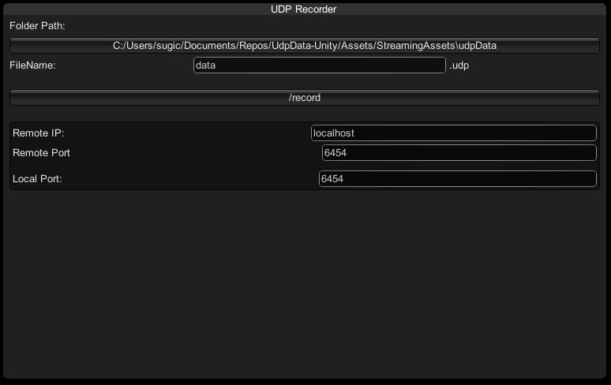

# UdpData-Unity

`udp = new Socket(AddressFamily.InterNetwork, SocketType.Dgram, ProtocolType.Udp);`

## UDP

[udpTest.unity](./Assets/UdpData/udpTest.unity)

test scene for Udp Server.

## Osc

[oscTest.unity](./Assets/UdpData/oscTest.unity)

test scene for Osc Server.

- [nobnak/unity-osc](https://github.com/nobnak/unity-osc)

## ArtNet

[artnetTest.unity](./Assets/UdpData/artnetTest.unity)

test scene for ArtNet Server.

- [MikeCodesDotNET/ArtNet.Net](https://github.com/MikeCodesDotNET/ArtNet.Net)
- [sugi-cho/ArtNet.Unity](https://github.com/sugi-cho/ArtNet.Unity)

---

## Recorder

- [recorder.unity](./Assets/UdpData/recorder.unity)
- [UdpRecorder.zip](./UdpRecorder.zip)

UdpPacketの記録と再生ができます。

センサーデータや外部機器から来るOsc、ArtNet等の通信の検証、実験に使用できます

### FolderPath

レコードデータを保存するフォルダです。ボタンを押すと、フォルダが開きます。（現状、StreamingAssetsフォルダ内に保存、**Editor内でレコード開始→別アプリでOSC操作→UnityEditorに戻る、と操作すると、UnityEditorが新しく作られたレコード中のファイルを読み込もうとして怒られます**）

### FileName

レコードデータのファイル名です。分かりやすい名前を入力しましょう。

フォルダ内に存在する場合は、既存のデータを再生するプレーヤー、フォルダ内にファイルが存在しない場合は新しいファイルにUdpデータを記録するレコーダーとして動作します。事故を防ぐため、上書き保存はできません。

### /record, /play, /stop

設定されているFileNameによって押せるボタンが変わります。Udpの記録の開始、記録されたファイルの再生の開始をします。__"create playData"ボタンはデバッグ用なので押したい人だけ押してください！スミマセン、将来的には無くなります__

記録/再生中は、stopボタンが有効になり、記録、再生を停止します。

何か信号に同期して記録/再生を開始したい場合もあるので、OscかUdp信号("/record"とか)を受け取って記録/再生を開始できます。__（未実装）__

### Remote IP / Remote Port

プレーヤーとして動作する際の、送信先のIP、ポート番号を設定します。

### Local Port

Udpを受け取る際の、ポート番号を設定します。

---

## これから

- 受け取ったUdpを見やすく表示する機能を付けたい
- Oscをアドレス毎に処理を登録できる実装
- ArtNetのHTPマージ、LTPマージ